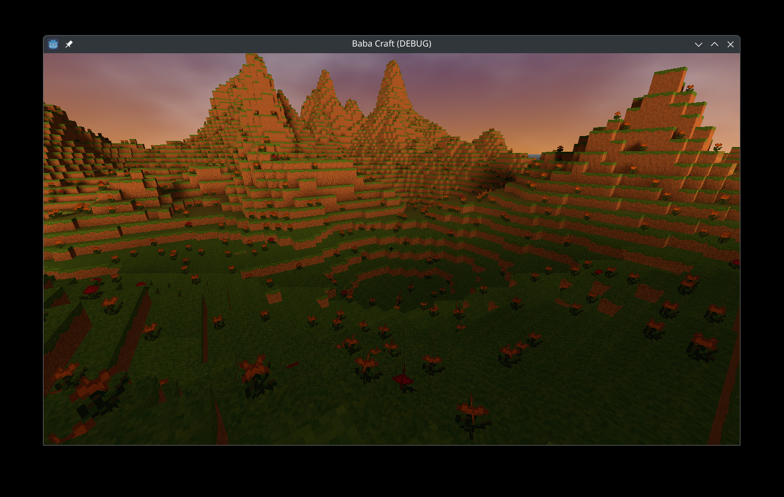

# Baba - Craft

Game dev training inspired by Minecraft



## About

The goal was to explore :
- meshes building
- terrain randomized generation (chunked based)
- multi threading approach with Godot

## Features

Use zqsd / wasd to move player.
Use the mouse : 
- to move the camera.
- right click to remove a block
- left click to create a block
- space to jump

## Getting Started

### Prerequisites

- [Godot Engine 4.4](https://godotengine.org/download)

### Installation

1. **Clone the repository:**

    ```
    git clone https://github.com/peebam/baba-pac
    ```

2. **Open the project in Godot Engine 4.4.**

3. **Run the project.**
